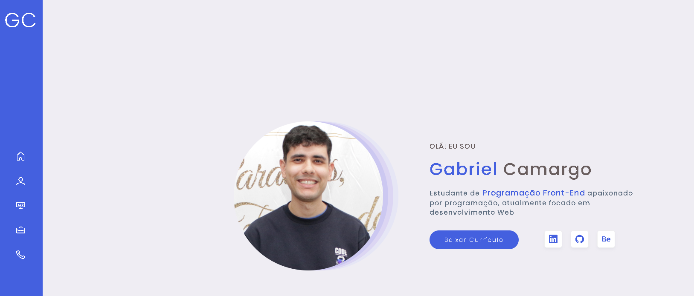

<h1 align="center">Meu Portfólio </h1>

<div align="center">

</div>

## 📝 Descrição 

Meu portfólio criado com o objetivo de mostrar meus projetos.

## 🚀 Demo

 [Clique aqui](https://gcs-portfolio.vercel.app/) e veja o projeto no ar.

 ## 🧪 Tecnologias

Esse projeto foi desenvolvido com as seguintes tecnologias:

- HTML
- CSS
- JavaScript
- SASS

### ​👷‍♂️​ Acessar o Projeto

<a href="https://github.com/Gabriel-Gith12/portfolio-gcs">Acesse aqui</a> o código fonte pelo GitHub.

Faça o <a href="https://github.com/Gabriel-Gith12/portfolio-gcs/archive/refs/heads/main.zip">Download aqui</a> do código fonte no formato zip.

Clone o repositório:

```
git clone https://github.com/Gabriel-Gith12/portfolio-gcs.git
```

## 📝 License

Esse projeto é licenciado pela MIT License. Clique [aqui](https://pt.wikipedia.org/wiki/Licen%C3%A7a_MIT) para mais detalhes.

## ✒️ Autor

<a href="https://github.com/brseghese">  </a>

  <h3 align="center"> Desenvolvido por <a href="https://www.linkedin.com/in/gabriel-camargo-4bb527216/">Gabriel Camargo</a></h3>